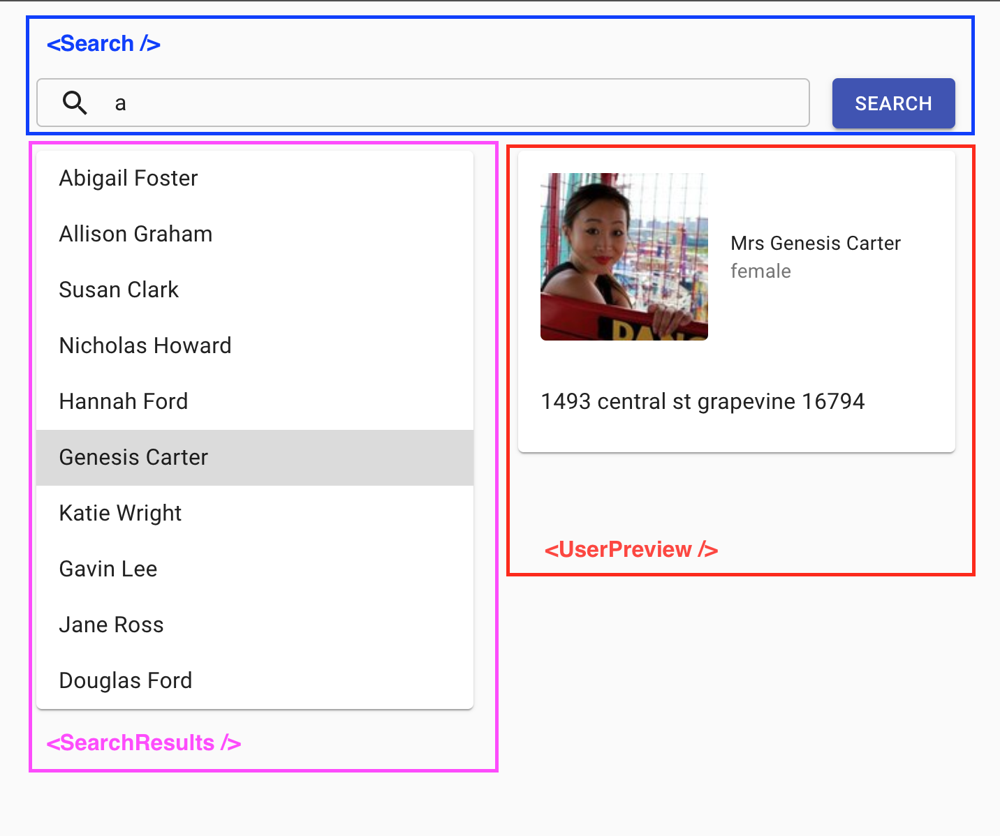

## Overview

[Quick preview](https://test-takers.herokuapp.com)

Project is written on typescript and using `nextjs` as framework. Used `Redux` for keeping application state. To make components looks awesome the project is using `material-ui` and `styled-components`. Components could be easily replaced to any other type of components.

## Development

To run project locally setup all dependency and execute next command

```
yarn run dev
```

## Folder Structure

    .
    ├── docs            # Documentation assets
    ├── mock_data       # Mock data in different formats
    └── src             # Working directory
        ├── components  # App components
        ├── models      # Model(typescript) types
        ├── pages       # Application pages
        ├── public      # Public content
        ├── services    # Services
        ├── store       # Redux store
        ├── theme       # App theme for MaterialUI
        └── utils       # Utils

## How it works

Appication contains 3 main components:


#### `<Search />`

Represent seacrh input.
Responsible for keeping search value in global store and fetching initial search request

#### `<SearchResults />`

Represents list of search results as infinyty scroll.
Responsible for loading more search results. By clicking on search results item mark item id as active in global state

#### `<UserPreview />`
Represent item details.
Responsible for loading more details by active item id.

### Data flow 
To fetch data from API `src/services/api.ts` or change global app state, components have to dispatch specific actions from `src/store/actions`

Response from API could be in different formats so that application must to apply adapter to the response data (`src/utils/adapters.ts`)

### Adapter
Util function `applyFileAdapters` received next parameters `(file, adapters)` where `file` is text representation of response, `adapters` is array of functions where each function is applied to the `file` to convert it to JSON in case of error next adapter is calling (from left to right)

Usage of `applyFileAdapters`:

```javascript
const json = await applyFileAdapters(textFile, [toJSON, csvToJSON, ...YourCustomAdapters])
```
